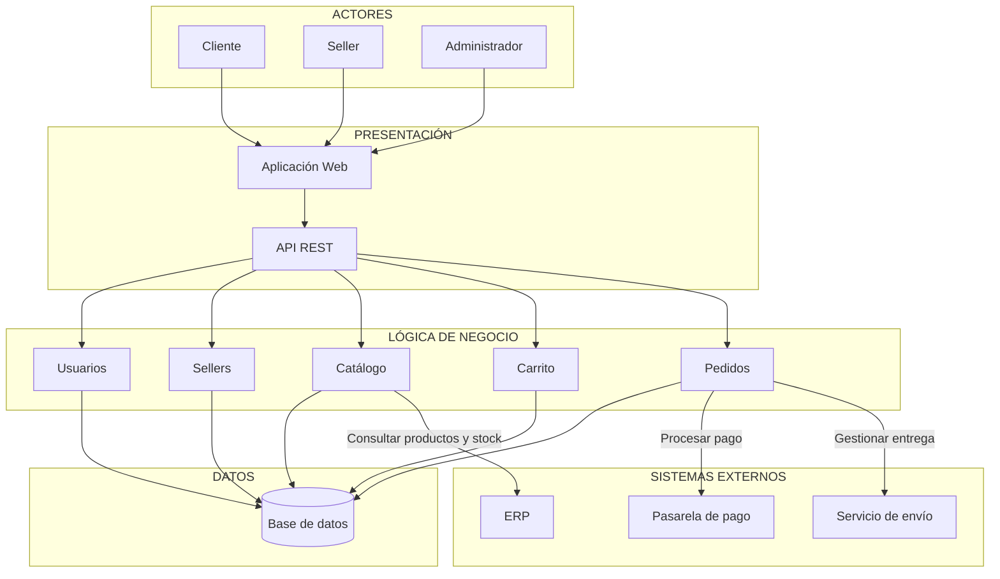

# Arquitectura inicial del sistema

## Ejercicio 09: Diseño de la arquitectura en capas

La primera propuesta organiza los módulos del marketplace en una arquitectura de tres capas:

```text
┌──────────────────────────────────────────────┐
│ PRESENTACIÓN                                 │
│ Aplicación web / API REST / Interfaz         │
└──────────────────────┬───────────────────────┘
                       ↓
┌──────────────────────────────────────────────┐
│ LÓGICA DE NEGOCIO                            │
│ Usuarios │ Sellers │ Catálogo │ Carrito      │
│ Pedidos                                      │
└──────────────────────┬───────────────────────┘
                       ↓
┌──────────────────────────────────────────────┐
│ DATOS                                        │
│ Base de datos                                │
└──────────────────────────────────────────────┘
```

| Capa | Responsabilidad | Pregunta que responde |
|---|---|---|
| Presentación | Proporciona la aplicación web y la API REST para interactuar con las funcionalidades del marketplace. | ¿Cómo interactúa el usuario? |
| Lógica de negocio | Implementa las reglas y operaciones de usuarios, sellers, catálogo, carrito y pedidos. | ¿Qué hace el sistema? |
| Datos | Almacena y permite consultar la información del sistema mediante una base de datos. | ¿Dónde se almacena la información? |

## Ejercicio 10: Diagrama de arquitectura inicial

El diagrama integra los actores, la presentación, los módulos de negocio, la base de datos y los sistemas externos identificados para el marketplace.



## Descripción

- **Presentación:** permite a clientes, sellers y administradores utilizar el marketplace mediante la aplicación web. La API REST recibe y expone las solicitudes hacia la lógica del sistema.
- **Lógica de negocio:** contiene los módulos de usuarios, sellers, catálogo, carrito y pedidos, que implementan las funcionalidades principales.
- **Datos:** la base de datos almacena la información necesaria para el funcionamiento del marketplace.
- **Sistemas externos:** los pedidos se integran con una pasarela de pago y un servicio de envío; el catálogo consulta productos y stock del ERP.
