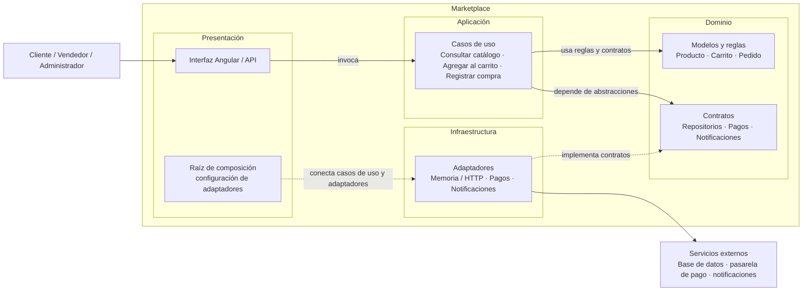

# Enfoque arquitectónico: Clean Architecture

## Descripción aplicada al Marketplace

| Elemento | Descripción aplicada al Marketplace |
|---|---|
| **Patrón / enfoque arquitectónico** | Clean Architecture (Arquitectura Limpia). |
| **Objetivo** | Separar responsabilidades y controlar las dependencias para que apunten hacia el dominio. |
| **¿Qué problema resuelve?** | Evita el acoplamiento entre la interfaz Angular, las reglas del negocio y las tecnologías externas, como bases de datos, API y servicios de pago. |
| **Capas definidas** | Presentación, Aplicación, Dominio e Infraestructura. |
| **Beneficios** | Facilita el mantenimiento y las pruebas unitarias.  Permite cambiar implementaciones técnicas sin modificar innecesariamente las reglas del negocio.  Mejora la organización y la separación de responsabilidades del código. |

## Responsabilidad de cada capa

- **Presentación:** interfaz Angular y puntos de entrada de la aplicación, como la API. Recibe las acciones de los actores y las deriva a casos de uso.
- **Aplicación:** casos de uso que coordinan operaciones del marketplace, como consultar el catálogo, agregar productos al carrito y registrar una compra.
- **Dominio:** entidades, reglas de negocio y contratos que definen lo que la aplicación necesita. No depende de Angular ni de proveedores tecnológicos.
- **Infraestructura:** adaptadores que implementan los contratos del dominio para acceder a persistencia, pagos, notificaciones y otros servicios externos.

## Regla de dependencias

Las dependencias de código apuntan hacia el centro: Presentación depende de Aplicación; Aplicación depende de Dominio; e Infraestructura implementa los contratos definidos por Dominio. Así, los casos de uso trabajan con abstracciones y no conocen los detalles de los adaptadores. La raíz de composición configura qué adaptador se utiliza.

En ejecución, una solicitud puede salir desde Presentación, pasar por un caso de uso y llegar a un adaptador mediante un contrato. Esto no cambia la dirección de las dependencias del código: el contrato permanece en el Dominio.

## Diagrama de capas y dependencias

El diagrama está escrito en Mermaid y puede visualizarse en GitHub o en un visor compatible con Mermaid.

## Ejemplo: registrar una compra

1. La presentación recibe la acción de compra y solicita al caso de uso `RegistrarCompra`.
2. El caso de uso aplica las reglas del dominio para validar el carrito, el stock y el pedido.
3. Para cobrar, guardar el pedido y notificar al cliente, el caso de uso utiliza los contratos definidos por el dominio.
4. Los adaptadores de infraestructura implementan esos contratos y se comunican con la pasarela, el mecanismo de persistencia y el servicio de notificaciones configurados.
5. La raíz de composición selecciona los adaptadores. En `boilerplate-main/`, por ejemplo, se pueden configurar implementaciones en memoria o alternativas HTTP y de pago.

De esta forma, sustituir un adaptador no obliga a modificar las reglas del dominio ni la lógica del caso de uso.
