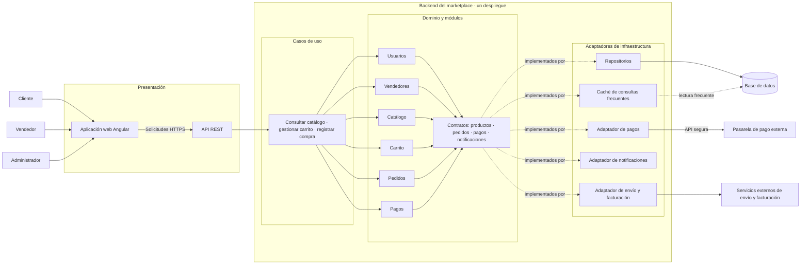

# Estilo arquitectónico del marketplace

## Propósito y alcance

Este documento define la estructura global propuesta para el marketplace de productos para mascotas. El estilo seleccionado combina un **monolito modular** como estructura de despliegue con **Clean Architecture** como organización interna. El diagrama muestra los principales componentes y sus relaciones, incluidos los sistemas externos.

La propuesta representa la arquitectura objetivo del sistema. El proyecto Angular de `boilerplate-main/` es una base de implementación académica: actualmente algunos adaptadores usan memoria y los pagos pueden simularse. Esas implementaciones no implican que ya estén desplegados una API, una base de datos, una caché o una pasarela real.

## Estilo seleccionado

### Monolito modular

El backend del marketplace se construirá y desplegará como una sola aplicación, organizada en módulos de negocio con responsabilidades delimitadas:

- **Usuarios:** cuentas, autenticación y perfiles.
- **Vendedores:** administración de vendedores y sus productos.
- **Catálogo:** consulta de productos, categorías y disponibilidad.
- **Carrito:** gestión de los productos seleccionados por el cliente.
- **Pedidos:** creación y seguimiento de compras.
- **Pagos:** coordinación de cobros mediante un contrato de pago.

Los módulos comparten el mismo despliegue, pero se comunican a través de responsabilidades y contratos definidos. Esta estructura evita la complejidad operativa de distribuir inicialmente el sistema en microservicios y permite evolucionar módulos con menor acoplamiento.

### Clean Architecture

Dentro de la aplicación, las dependencias apuntan hacia el dominio:

1. **Dominio:** modelos, reglas de negocio y contratos que expresan lo que el sistema necesita.
2. **Aplicación:** casos de uso que coordinan operaciones, como consultar el catálogo, agregar productos al carrito y registrar una compra.
3. **Infraestructura:** adaptadores que implementan los contratos para persistencia, caché, pagos y notificaciones.
4. **Presentación:** interfaz web y API que reciben las solicitudes y exponen los resultados.

Los casos de uso dependen de contratos, no de proveedores tecnológicos concretos. La raíz de composición selecciona las implementaciones de esos contratos.

## Diagrama global

El siguiente diagrama está escrito en Mermaid y puede visualizarse en GitHub o en un visor compatible con Mermaid.

## Relaciones y flujo principal

1. El cliente, vendedor o administrador utiliza la aplicación web.
2. La aplicación web envía solicitudes HTTPS a la API del marketplace.
3. La API delega cada operación al caso de uso correspondiente.
4. Los casos de uso coordinan los módulos y las reglas del dominio; no conocen la tecnología de persistencia ni el proveedor de pago.
5. Los contratos del dominio son implementados por adaptadores de infraestructura. Los repositorios acceden a la base de datos y la caché puede atender consultas frecuentes.
6. El adaptador de pagos integra el módulo de Pagos con la pasarela externa. Los adaptadores de envío, facturación y notificaciones encapsulan sus respectivos servicios.

Para registrar una compra, el caso de uso valida el carrito y el stock, solicita el cobro a través del contrato de pagos y, si se aprueba, registra el pedido y notifica al cliente.

## Decisiones y atributos relacionados

| Decisión | Aplicación en el estilo |
|---|---|
| ADR-001 - Monolito modular | Módulos de negocio independientes dentro de un único despliegue del backend. |
| ADR-002 - Clean Architecture | Separación entre dominio, aplicación, infraestructura y presentación; las dependencias apuntan hacia el dominio. |
| ADR-003 - Estrategia de caché | Adaptador de caché para reducir lecturas repetitivas de información consultada con frecuencia. |
| ADR-004 - Integración de pagos mediante interfaces y adaptadores | El caso de uso invoca un contrato; el adaptador traduce la operación al protocolo de la pasarela externa. |

La modularidad y la inversión de dependencias favorecen la mantenibilidad. La caché y el despliegue único con módulos delimitados permiten abordar el rendimiento y el crecimiento sin introducir prematuramente una arquitectura distribuida.

## Consideraciones de implementación

- Las credenciales y los datos sensibles de pago deben permanecer en el backend; la aplicación web no debe conectarse directamente a la pasarela usando secretos.
- La caché es una capacidad arquitectónica propuesta y debe añadirse cuando se definan sus datos, expiración e invalidación; no se considera implementada por el adaptador en memoria del boilerplate.
- `boilerplate-main/` contiene una base Angular con casos de uso y adaptadores intercambiables. Sus adaptadores en memoria y pagos simulados sirven para la demostración; la persistencia y las integraciones reales requieren configuración e implementación adicionales.
